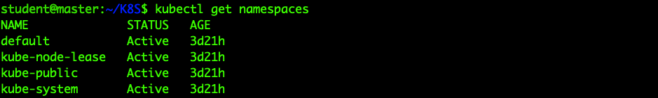
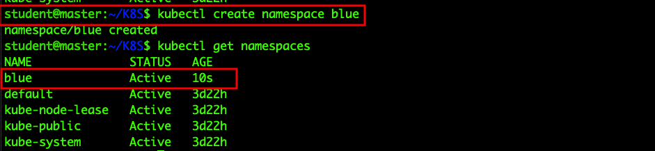

# 5. LAB-4 Namespace

{ :no_toc }

  
  

    Table of contents
  

  {: .text-delta }
1. TOC  
{:toc}

## Create namespace

### Check namespace list  

    $ kubectl get namespace  

### Basic Command  

    $ kubectl create namespace blud  

### Create namespace through YAML

#### Check the yaml form through yaml extracted

## Delete namespace  

## Check pods information in namespace  

### Basic Command  

### Check pods in namespace 'kube-system'

## Create pod in namespace  

### Create pod in namespace through YAML

## Assignment-1  

* Q. Delete pod 'webserver' in namespace blue through kubectl command.

## Assignment-2

* Q. Check how is pod's status will be after deleting namespace orange through kubectl command.

## Assignment-3

* Q. Create YAML file for creating a nameserver, and a pod at the same time. The conditions are followed below.

## Change default namespace name  
